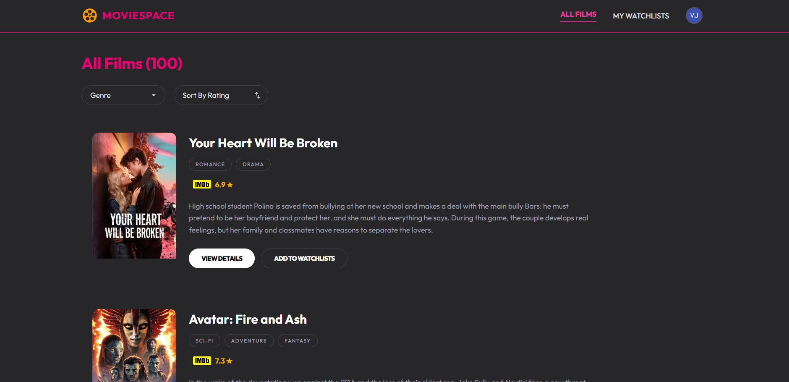
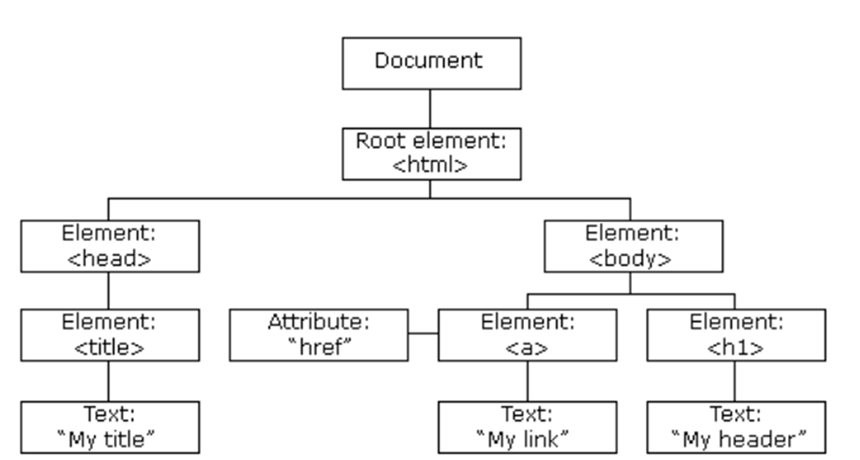
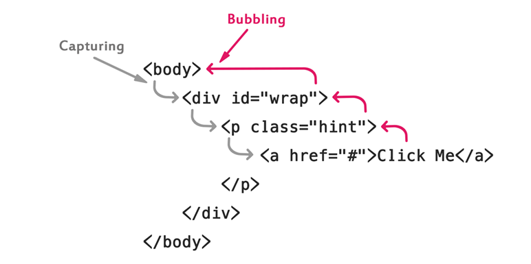

## 🛠️ Persiapan Lokal

Untuk menjalankan proyek ini di komputer kamu, ikuti langkah-langkah berikut:

1. **Clone Repository**
   Gunakan perintah berikut untuk mengambil branch utama:
   ```bash
   git clone https://github.com/aqilknz/movie-apps.git
   ```
2. **Deploy di Vercel**
   Klik link dibawah ini:
   ```bash
   https://movie-apps-phi.vercel.app/
   ```

## Catalogue Movie List

Proyek ini merupakan aplikasi web katalog daftar film yang dibangun menggunakan TailwindCSS untuk styling dan JavaScript DOM untuk manipulasi halaman secara dinamis.


## DOM (Document Object Model)

DOM merupakan **antarmuka pemrograman** yang merepresentasikan struktur dokumen HTML sebagai **pohon objek (node tree)**. Berbentuk object, dengan DOM JavaScript bisa mengubah struktur, gaya, dan isi halaman secara **real-time**.  
Struktur DOM menyerupai silsilah keluarga disebut sebagai DOM Tree. Di puncaknya terdapat akar atau Root yaitu document. Setiap elemen, atribut, dan potongan teks di dalam HTML direpresentasikan sebagai Node (simpul) dalam pohon ini.
Bersifat Hierarkis, contoh element body sebagai parent dan element h1 sebagai child



## DOM Method

DOM memiliki fungsi untuk mengakses dan memanipulasi element dan styling yang dibuat secara dinamis.

### Method Utama

| Method                            | Fungsi                                                     |
| --------------------------------- | ---------------------------------------------------------- |
| `document.getElementById`         | Mengambil elemen berdasarkan ID                            |
| `document.getElementsByClassName` | Mengambil elemen berdasarkan nama class                    |
| `document.querySelector`          | Mengambil elemen pertama yang cocok dengan selector CSS    |
| `document.addEventListener`       | Menambahkan event listener pada document                   |
| `element.addEventListener`        | Menambahkan event listener pada elemen tertentu            |
| `node.innerHTML`                  | Membaca atau mengubah konten HTML di dalam elemen          |
| `node.innerText`                  | Mengambil atau mengubah konten teks di dalam sebuah elemen |
| `node.insertAdjacentHTML`         | Menyisipkan atau menambahkan elemen HTML baru              |

### Contoh Penggunaan

```javascript
// Mengambil elemen berdasarkan ID
const container = document.getElementById("movieContainer");
// Membuat elemen baru
const option = document.createElement("option");
// Menambahkan Event Listener pada Document
document.addEventListener("DOMContentLoaded", () => {});
// Menambah Event Listener pada Element
selectElement.addEventListener("change", (e) => {});
// Mengubah konten HTML
movieContainer.innerHTML = `<p class="text-center py-20 text-pink-500">Failed to load movies.</p>`;
// Mengubah konten teks pada elemen HTML
paginationText.innerText = `${startRange} - ${endRange} of ${totalMoviesGoal}`;
// Menyisipkan atau menambahkan elemen HTML baru
container.insertAdjacentHTML("beforeend", movieCard);
```

## Window vs Document

### Window

Objek **Window** mewakili seluruh jendela browser yang sedang terbuka. Ini adalah **Global Object**, artinya semua variabel, fungsi, atau objek (termasuk `Document`) adalah "anak" atau properti dari Window.

**Properti Window:**

- `window.localStorage` – Penyimpanan data lokal di browser
- `window.scrollTo` – Scroll halaman ke posisi tertentu
- `window.location` – Informasi URL dan navigasi
- `window.alert()` – Menampilkan dialog alert

**Contoh Penerapan :**

```JavaScript
// Melakukan navigasi ke halaman tertentu
window.location.href = 'login.html';
// Menyimpan data ke browser storage
window.localStorage.setItem('users', JSON.stringify(existingUsers));
// Scroll halaman ke posisi tertentu
window.scrollTo({ top: 0, behavior: 'smooth' });
// Menampilkan dialog alert atau peringatan
window.alert('Silakan login terlebih dahulu untuk mengakses Watchlist Anda!');
```

### Document

Objek **Document** mewakili konten atau halaman web yang dimuat di dalam jendela tersebut. Objek ini adalah bagian dari Window dan hanya berfokus pada apa yang ada di dalam tag `<html>`, seperti `<body>`, `<div>`, `<form>`, dan elemen visual lainnya.

**Metode Utama Document:**

- `document.getElementById()`
- `document.querySelector()`
- `document.createElement()`

**Contoh Penerapan :**

```JavaScript
// Mengambil elemen berdasarkan ID
const container = document.getElementById("movieContainer");
// Membuat elemen baru
const option = document.createElement("option");
```

### Perbandingan Window vs Document

| Window                                               | Document                                   |
| ---------------------------------------------------- | ------------------------------------------ |
| Representasi jendela browser                         | Representasi halaman atau isi dokumen HTML |
| Top-Level                                            | Objek child dari window                    |
| Mengontrol browser (navigasi, tab, storage)          | Mengontrol isi konten (DOM manipulation)   |
| Dipanggil langsung dengan `window` atau tanpa prefix | Melalui `window.document` atau `document`  |
|                                                      |                                            |

## Event Propagation

**Event Propagation** merupakan cara browser menangani kejadian (event) yang terjadi pada elemen yang bersarang (elemen di dalam elemen), atau disebut juga penyebaran event.

### Fase Propagasi



1. **Capture Phase** – Event turun dari luar (hierarki atas) ke target element
2. **Target Phase** – Tempat terjadinya event
3. **Bubbling Phase** – Setelah sampai ke target, event akan naik ke atas parentnya satu per satu sampai ke `window`

**Event Bubbling** adalah mekanisme di mana sebuah peristiwa (seperti click, keydown, dll.) yang dipicu pada elemen anak/child (target) akan merambat ke atas melalui elemen sebelumnya atau parent dalam struktur DOM.
Untuk menghentikannya bisa menggunakan:

**Contoh Penerapan:**

```JavaScript
profileToggle.addEventListener('click', (e) => {
    //hentikan bubbling ke document
   e.stopPropagation();
   logoutMenu.classList.toggle('hidden');
});

// Jika stopPropagation() tidak ada:
// klik profileToggle → toggle menu (buka) → bubble ke document → menu langsung ditutup lagi
document.addEventListener('click', () => {
   logoutMenu.classList.add('hidden'); // tutup menu jika klik di luar
});
```

## HTTP Request: GET & POST

Dalam pengembangan web, terutama saat mengambil atau mengirim data ke server (seperti data film dari API), dua metode HTTP yang paling umum digunakan adalah **GET** dan **POST**.

### GET

Metode **GET** digunakan untuk mengambil/membaca data dari server. Data dikirimkan melalui URL sebagai query parameter.

**Karakteristik GET:**

- Data terlihat di URL
- Cocok untuk mengambil data (tidak mengubah state server)
- Dapat di-bookmark dan di-cache
- Panjang URL terbatas

**Contoh GET di Movie-Apps:**

```javascript
async function fetchMovies(page = 1) {
  try {
    // URL GET (secara default) dengan query parameter
    let url = `${BASE_URL}/discover/movie?api_key=${API_KEY}&language=en-US&page=${page}&sort_by=popularity.desc`;

    // Tambah filter genre jika dipilih
    if (currentGenre) {
      url += `&with_genres=${currentGenre}`;
    }

    // GET Request (default method fetch)
    const response = await fetch(url);
    const data = await response.json();

    console.log(data);
  } catch (error) {
    console.error("Error:", error);
  }
}
```

### POST

Metode **POST** digunakan untuk mengirim data ke server, misalnya menambahkan film baru ke katalog atau login pengguna.

**Karakteristik POST:**

- Data dikirim di dalam body request (tidak terlihat di URL)
- Cocok untuk mengirim data sensitif atau data dalam jumlah besar
- Tidak dapat di-bookmark
- Biasanya mengubah state di server

**Contoh POST dengan Fetch API:**

```javascript
// Menambahkan film baru ke katalog
async function addMovie(movieData) {
  try {
    const response = await fetch("https://api.example.com/movies", {
      method: "POST",
      headers: {
        "Content-Type": "application/json",
      },
      body: JSON.stringify(movieData),
    });

    if (!response.ok) {
      throw new Error(`HTTP error! status: ${response.status}`);
    }

    const result = await response.json();
    console.log("Film berhasil ditambahkan:", result);
    return result;
  } catch (error) {
    console.error("Gagal menambahkan film:", error);
  }
}

// Memanggil fungsi POST
const newMovie = {
  title: "Laskar Pelangi",
  genre: "Drama, Action",
  year: 2008,
  rating: 8.6,
};

addMovie(newMovie).then((result) => {
  // Update tampilan setelah berhasil POST
  document.getElementById("status").textContent = "Film berhasil ditambahkan!";
});
```

### Perbandingan GET vs POST

| Aspek        | GET                  | POST                    |
| ------------ | -------------------- | ----------------------- |
| Tujuan       | Ambil data           | Kirim data              |
| Letak Data   | URL                  | Body request            |
| Cache        | Bisa                 | Tidak bisa              |
| Bookmark     | Bisa                 | Tidak bisa              |
| History      | Tersimpan di URL     | Tidak tersimpan         |
| Panjang Data | Maks. 2048 karakter  | Tidak terbatas          |
| Tipe Data    | Hanya ASCII          | Semua tipe (binary dll) |
| Keamanan     | Kurang aman          | Lebih aman              |
| Visibilitas  | Data terlihat di URL | Data tersembunyi        |
